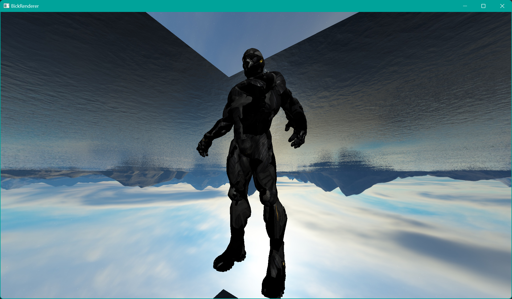
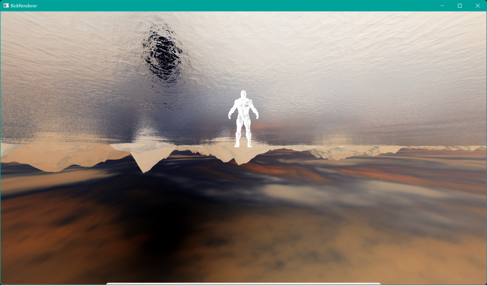

<!--
 * @Author: Vanish
 * @Date: 2024-09-13 21:46:04
 * @LastEditTime: 2024-11-29 16:03:00
 * Also View: http://vanishing.cc
 * Copyright@ https://creativecommons.org/licenses/by/4.0/deed.zh-hans
-->
# BickRenderer

此项目目标是实现一个基于OpenGL的光栅化渲染器,以支持作者个人的图形学学习.

# Goals
- [x] Lighting
  - [x] Point Light
  - [x] Directional Light
  - [ ] Spot Light
  - [ ] Area Light
- [x] Material
  - [x] Diffuse Material
  - [ ] Specular Material
  - [ ] Emissive Material
  - [ ] BRDF Material
  - [ ] BSDF Material
- [x] Texturing
  - [x] 2D Texture
  - [ ] Cube Texture
  - [ ] 3D Texture
- [x] Model
  - [x] OBJ Model
- [x] Post-Processing
  - [ ] Bloom
  - [ ] SSAO
  - [ ] FXAA
  - [ ] Tonemapping
  - [ ] Motion Blur
  - [ ] Depth of Field
  - [ ] Lut
- [x] Environment Lighting
  - [x] CubeMap
  - [ ] IBL
  - [ ] PRT
- [ ] Shadow Mapping
  - [ ] PCF
  - [ ] PCSS
  - [ ] VSM
- [ ] Acceleration
  - [ ] BVH
  - [ ] CPU Culling
  - [ ] Static Batching
  - [ ] Dynamic Batching
  - [ ] LOD
- [x] Code Structure
  - [x] Object System
  - [x] Material System
  - [x] Pass System
  - [ ] Debug System
  - [ ] UI System

# Render Result

